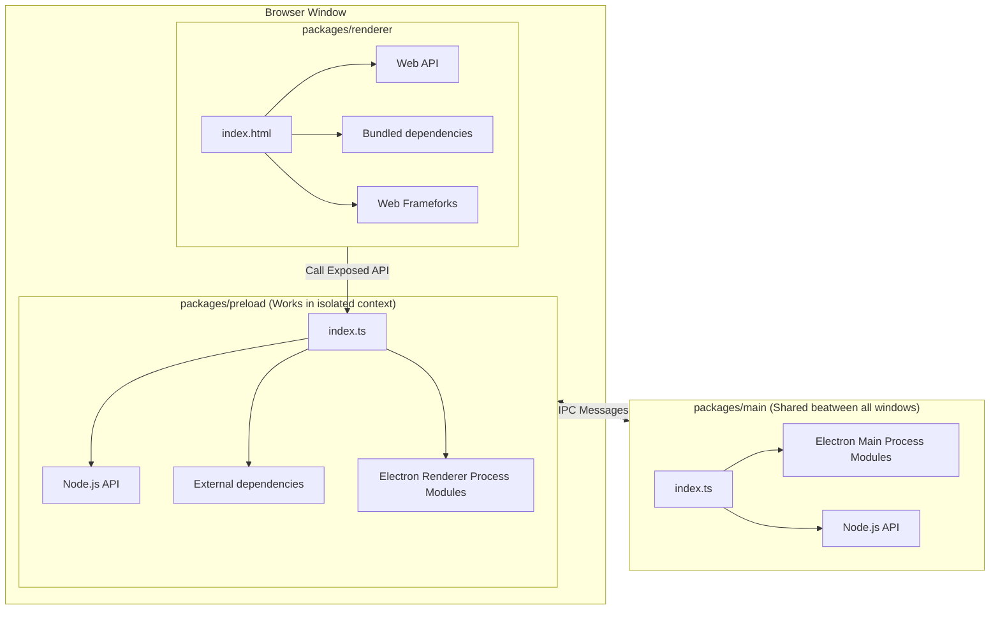
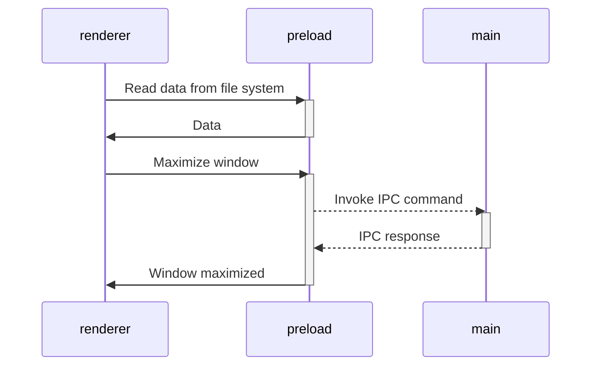

# electron-typescript-vite-vue-starter

This is a template for secure electron applications. Written following the latest safety requirements, recommendations
and best practices.

Under the hood is [Vite] — A next-generation blazing fast bundler, and [electron-builder] for packaging.

## History

This repo was originally forked from an excellent starter by Alex Kozack that can be found here: [vite-electron-builder](https://github.com/cawa-93/vite-electron-builder)

The focus of this repo is to add features that support development under WSL for builds targeting the Windows operating system. Issues pertaining to Linux and macOS are likely to be ignored and unknown. For the target audience, the workflow is roughly thus:

1. Make changes
2. Run `npm run dev` and an X server (i.e. VcXsrv) installed and running in the Windows OS shows the Linux executable running out of WSL. Hot module replacement works so changes can be made debugged live in many cases.
3. Run `npm run compile:windows` to regenerate the files in `dist/win-unpacked`
4. Copy the `win-unpacked` folder outside of the WSL filesystem; desktop is fine, script is better
5. Run the executable in the `win-unpacked\` folder you copied the files into.

One of the main changes in this version is that when compiling for Windows 10 or higher it utilizes `MicaBrowserWindow` from [GregVido/mica-electron](https://github.com/GregVido/mica-electron). And, by default, MicaBrowserWindow is configured to apply the Acrylic frosted-glass effect to the electron window!

## Change Log

### 1.0.0
- Add `npm run dev` to build and watch in one step
- Add `npm run compile:windows` to build only for windows
- Add support for MicaBrowserWindow and acrylic

## Features

### Electron

- This template uses the latest electron version with all the latest security patches.
- The architecture of the application is built according to the
  security [guides](https://www.electronjs.org/docs/tutorial/security) and best practices.
- The latest version of the [electron-builder] is used to package the application.

### Vite

- [Vite] is used to bundle all source codes. It's an extremely fast bundler, that has a vast array of amazing features.
  You can learn more about how it is arranged in [this](https://www.youtube.com/watch?v=xXrhg26VCSc) video.
- Vite [supports](https://vitejs.dev/guide/env-and-mode.html) reading `.env` files. You can also specify the types of
  your environment variables in [`types/env.d.ts`](types/env.d.ts).
- Automatic hot-reloads for the `Main` and `Renderer` processes.

Vite provides many useful features, such as: `TypeScript`, `TSX/JSX`, `CSS/JSON Importing`, `CSS Modules`
, `Web Assembly` and much more.

> [See all Vite features](https://vitejs.dev/guide/features.html).

### TypeScript (optional)

- The latest version of TypeScript is used for all the source code.
- **Vite** supports TypeScript out of the box. However, it does not support type checking.
- Code formatting rules follow the latest TypeScript recommendations and best practices thanks
  to [@typescript-eslint/eslint-plugin](https://www.npmjs.com/package/@typescript-eslint/eslint-plugin).

> [Guide to disable typescript and remove dependencies](https://github.com/cawa-93/vite-electron-builder/discussions/339)

### Vue

- By default, web pages are built using [Vue]. However, you can easily change that. Or not use additional frameworks at
  all.
- Code formatting rules follow the latest Vue recommendations and best practices thanks to [eslint-plugin-vue].

> [Find more forks 🔱 for others frameworks or setups](https://github.com/cawa-93/vite-electron-builder/discussions/categories/forks)

## Project Structure

The structure of this template is very similar to a monorepo. The entire source code of the project is divided into three modules (packages) that are each bundled independently:

- [`packages/renderer`](packages/renderer). Responsible for the contents of the application window. In fact, it is a
  regular web application. In developer mode, you can even open it in a browser. The development and build process is
  the same as for classic web applications. Access to low-level API electrons or Node.js is done through the _preload_
  layer.
- [`packages/preload`](packages/preload). Contain Electron [**preload scripts**](https://www.electronjs.org/docs/latest/tutorial/tutorial-preload). Acts as an intermediate bridge between the _renderer_ process and the API
  exposed by electron and Node.js. Runs in an _isolated browser context_, but has direct access to the full Node.js
  functionality.
- [`packages/main`](packages/main)
  Contain Electron [**main script**](https://www.electronjs.org/docs/tutorial/quick-start#create-the-main-script-file). This is
  the main process that powers the application. It manages creating and handling the spawned BrowserWindow, setting and
  enforcing secure permissions and request handlers. You can also configure it to do much more as per your need, such
  as: logging, reporting statistics and health status among others.

Schematically, the structure of the application and the method of communication between packages can be depicted as follows:


## Build

The `main` and `preload` packages are built in [library mode](https://vitejs.dev/guide/build.html#library-mode) as it is
simple javascript.

The `renderer` package builds as a regular web app.

## Compile

The next step is to package a ready to distribute Electron app for macOS, Windows and Linux with "auto update" support
out of the box.

To do this, use [electron-builder]:

- Using the npm script `compile`: This script is configured to compile the application as quickly as possible. It is not
  ready for distribution, it is compiled only for the current platform and is used for debugging.
- Using GitHub Actions: The application is compiled for any platform and ready-to-distribute files are automatically
  added as a draft to the GitHub releases page.

## Dependencies

Because the `renderer` works and builds like a _regular web application_, you can only use dependencies that support the
browser or compile to a browser-friendly format.

This means that in the `renderer` you are free to use any frontend dependencies such as Vue, React, lodash, axios and so
on. However, you _CANNOT_ use any native Node.js APIs, such as, `systeminformation`. These APIs are _only_ available in
a Node.js runtime environment and will cause your application to crash if used in the `renderer` layer. Instead, if you
need access to Node.js runtime APIs in your frontend, export a function form the `preload` package.

All dependencies that require Node.js api can be used in
the [`preload` script](https://www.electronjs.org/docs/latest/tutorial/process-model#preload-scripts).

### External Functions & Renderer

Here is an example. Let's say you need to read some data from the file system or database in the renderer.

In the preload context, create a function that reads and returns data. To make the function announced in the preload
available in the render, you usually need to call
the [`electron.contextBridge.exposeInMainWorld`](https://www.electronjs.org/ru/docs/latest/api/context-bridge). However,
this template uses the [unplugin-auto-expose](https://github.com/cawa-93/unplugin-auto-expose) plugin, so you just need
to export the method from the preload. The `exposeInMainWorld` will be called automatically.

```ts
// preload/index.ts
import { readFile } from 'node:fs/promises';

// Encapsulate types if you use typescript
interface UserData {
  prop: string
}

// Encapsulate all node.js api
// Everything you exported from preload/index.ts may be called in renderer
export function getUserData(): Promise<UserData> {
  return readFile('/path/to/file/in/user/filesystem.json', {encoding:'utf8'}).then(JSON.parse);
}
```

Now you can import and call the method in renderer

```ts
// renderer/anywere/component.ts
import { getUserData } from '#preload'
const userData = await getUserData()
```

> Find more in [Context Isolation tutorial](https://www.electronjs.org/docs/tutorial/context-isolation#security-considerations).

## Electron API

Although the preload has access to all of Node.js's API, it **still runs in the BrowserWindow context**, so a limited
electron modules are available in it. Check the [electron docs](https://www.electronjs.org/ru/docs/latest/api/clipboard)
for full list of available methods.

All other electron methods can be invoked in the `main`.

As a result, the architecture of interaction between all modules is as follows:



> Find more in [Inter-Process Communication tutorial](https://www.electronjs.org/docs/latest/tutorial/ipc).

## Modes and Environment Variables

All environment variables are set as part of the `import.meta`, so you can access them vie the following
way: `import.meta.env`.

> **Note**:
> If you are using TypeScript and want to get code completion you must add all the environment variables to
the [`ImportMetaEnv` in `types/env.d.ts`](types/env.d.ts).

The mode option is used to specify the value of `import.meta.env.MODE` and the corresponding environment variables files
that need to be loaded.

By default, there are two modes:

- `production` is used by default
- `development` is used by `npm run watch` script

When running the build script, the environment variables are loaded from the following files in your project root:

```
.env                # loaded in all cases
.env.local          # loaded in all cases, ignored by git
.env.[mode]         # only loaded in specified env mode
.env.[mode].local   # only loaded in specified env mode, ignored by git
```

> **Warning**:
> To prevent accidentally leaking env variables to the client, only variables prefixed with `VITE_` are exposed to your
Vite-processed code.

For example let's take the following `.env` file:

```
DB_PASSWORD=foobar
VITE_SOME_KEY=123
```

Only `VITE_SOME_KEY` will be exposed as `import.meta.env.VITE_SOME_KEY` to your client source code, but `DB_PASSWORD`
will not.

You can change that prefix or add another. See [`envPrefix`](https://vitejs.dev/config/shared-options.html#envprefix)

## Contribution

See [Contributing Guide](contributing.md).

[vite]: https://github.com/vitejs/vite/

[electron]: https://github.com/electron/electron

[electron-builder]: https://github.com/electron-userland/electron-builder

[vue]: https://github.com/vuejs/vue-next

[vue-router]: https://github.com/vuejs/vue-router-next/

[typescript]: https://github.com/microsoft/TypeScript/

[vue-tsc]: https://github.com/johnsoncodehk/vue-tsc

[eslint-plugin-vue]: https://github.com/vuejs/eslint-plugin-vue
